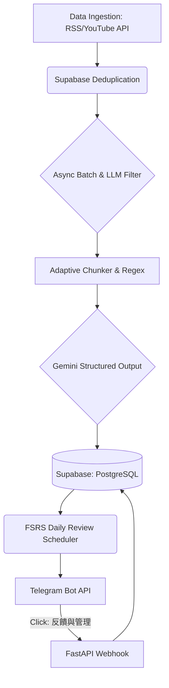

## 🚀 KnowFetch

**KnowFetch** 是一個全自動的「個人化技術知識圖譜與複習系統」。專為解決資訊焦慮與碎片化學習而生，能自動抓取並提煉優質的技術文章與影片內容，最終透過 Telegram 推播，搭配 **FSRS (間隔重複)** 演算法，幫助使用者用極低的認知成本吸收並牢記技術知識。

本專案展現了從資料管線 (Data Pipeline) 建立、LLM 內容萃取到 Chatbot 互動的完整端到端 (End-to-End) 開發流程，並透過 Serverless 架構與 API 整合，實現高可用且「零維運成本」的雲端部署。

---

### 📊 核心特色與技術流程 (Key Features & Workflow)

1. **資料收集 (Data Ingestion)**
   - 定時巡邏指定的技術網站 RSS (如 KDnuggets, Towards Data Science) 與 YouTube 頻道 (透過 YouTube Data API v3 抓取影片清單與字幕)。
   - 結合 Supabase 實作去重機制 (Deduplication)，確保來源不重複爬取。
2. **AI 清洗與內容萃取 (Data Processing & LLM Extraction)**
   - 利用 Gemini 進行大文本的意圖辨識與過濾，精準剃除不相關的雜訊。
   - 使用自訂 Regex 處理長文切塊 (Chunking)，保護程式碼區塊完整性。並透過 LLM 將長文轉化為具備上下文與「最佳實踐 (Best Practices)」的雙語知識卡片。
3. **資料儲存 (Data Storage)**
   - 使用 PostgreSQL 儲存結構化內容，並利用外鍵 (Foreign Key) 與關聯設計，低成本模擬出知識圖譜 (Knowledge Graph) 的拓撲關係。
4. **推播與互動回饋 (Notification & Feedback)**
   - 系統依據 FSRS 演算法，計算每日應複習的知識點，主動推播至 Telegram。
   - 實作 Webhook 即時接收使用者反饋，使用者可點擊「略過/刪除」，系統將自動從資料庫抹除關聯資料，並將來源加入黑名單。

---

### 🏗️ 系統架構 (Architecture)



### 🛠️ Tech Stack
- **Backend Core**: Python 3.10+, `FastAPI`, `asyncio`, `httpx`, `Pydantic`
- **Data & AI**: Google GenAI SDK (`Gemini 3.1 Flash-Lite`), `BeautifulSoup4`, `NetworkX`
- **Database**: Supabase (`PostgreSQL`, `SQLAlchemy`)
- **Integration & APIs**: YouTube Data API v3, Telegram Bot API
- **Deployment**: `Docker`, Hugging Face Spaces (Serverless HTTP Trigger)

---

### 💻 快速啟動 (Quick Start)

**1. 環境安裝**
```bash
git clone https://github.com/yourusername/knowfetch.git
cd knowfetch
pip install -r requirements.txt
```

**2. 環境變數設定 (`.env`)**
```env
GEMINI_API_KEY=your_gemini_api_key
SUPABASE_URL=your_supabase_url
SUPABASE_KEY=your_supabase_anon_key
TELEGRAM_BOT_TOKEN=your_telegram_bot_token
YOUTUBE_API_KEY=your_youtube_v3_api_key
TELEGRAM_CHAT_ID=your_telegram_chat_id
CRON_SECRET=your_cron_secret
REVIEW_BATCH_SIZE=2
```
*(註：若部署於 Hugging Face 等平台，系統會自動抓取 `SPACE_HOST` 來配置 Webhook URL，本機測試也可自行加上 `WEBHOOK_URL`)*

**3. 啟動伺服器**
```bash
uvicorn app.main:app --host 0.0.0.0 --port 7860
```
*(伺服器啟動時，將自動向 Telegram 註冊 Webhook 並等待 Cron API 呼叫來觸發排程)*
