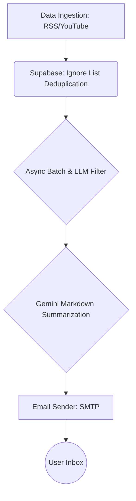

## 🚀 KnowFetch

**KnowFetch** 是一個全自動的「個人化技術文章摘要與推播系統」。專為解決資訊焦慮與碎片化學習而生，能自動抓取優質的技術文章與影片內容，透過 LLM 提煉重點精華，並每天以 **Email** 的方式寄送到您的信箱，確保您用最低的認知成本掌握每日技術趨勢。

本專案展現了從資料管線 (Data Pipeline) 建立、LLM 內容萃取到自動化郵件排版的完整流程，並透過 Serverless 架構與 API 整合，實現高可用且「零維運成本」的雲端部署。

---

### 📊 核心特色與技術流程 (Key Features & Workflow)

1. **資料收集 (Data Ingestion)**
   - 定時巡邏指定的技術網站 RSS (如 KDnuggets, Towards Data Science) 與 YouTube 頻道。
   - 結合 Supabase 實作去重機制 (Deduplication)，確保來源不重複處理。
2. **AI 清洗與內容萃取 (Data Processing & LLM Summarization)**
   - 利用 Gemini 進行大文本的意圖辨識與過濾，精準剃除不相關的雜訊或純名詞解釋的無用文章。
   - 透過 LLM 直接對中高價值文章進行總結，產出含有「情境與痛點」、「核心觀念 / 最佳實踐」、「程式碼範例」的高品質 Markdown 筆記。
3. **郵件推播系統 (Email Delivery)**
   - 重點整理完成後，系統會自動轉譯排版並透過 SMTP (例如 Gmail) 發送至使用者的個人信箱，達到每日一篇信件的無痛學習體驗。

---

### 🏗️ 系統架構 (Architecture)



### 🛠️ Tech Stack
- **Backend Core**: Python 3.10+, `FastAPI`, `asyncio`, `httpx`, `Pydantic`
- **Data & AI**: Google GenAI SDK (`Gemini 3.1 Flash-Lite`), `BeautifulSoup4`
- **Database**: Supabase (`PostgreSQL`, `SQLAlchemy` - 用於已讀名單去重)
- **Integration & APIs**: YouTube Data API v3, `smtplib` (Email 傳送)
- **Deployment**: `Docker`, Hugging Face Spaces (Serverless HTTP Trigger)

---
### 🛡️ 系統穩定性優化 (Reliability Features)

針對 Hugging Face Spaces 等特定雲端環境的限制，本系統實作了以下優化：
- **全域 IPv4 強制連線**：解決 HF Spaces 上 IPv6 路由不通導致的隨機 `ConnectTimeout`。
- **爬蟲智慧降速策略**：透過計算當日更新量並自動計算延遲間隔（加入隨機抖動），將爬蟲生命週期合理化延展，避免遭防爬機制封鎖。
- **錯峰排程與喚醒機制**：透過 GitHub Actions Cron 以 HTTP POST 方式喚醒機制，降低系統資源處於休眠被凍結的問題。

---

### 💻 快速啟動 (Quick Start)

**1. 環境安裝**
```bash
git clone https://github.com/yourusername/knowfetch.git
cd knowfetch
pip install -r requirements.txt
```

**2. 環境變數設定 (`.env`)**
請在專案根目錄下建立 `.env` 檔案並填入以下內容：
```env
# Google Gemini
GEMINI_API_KEY=your_gemini_api_key

# Supabase (用於儲存看過的文章清單)
SUPABASE_URL=your_supabase_url
SUPABASE_KEY=your_supabase_anon_key

# YouTube API
YOUTUBE_API_KEY=your_youtube_v3_api_key

# API Cron 安全金鑰
CRON_SECRET=your_cron_secret

# Email 推播設定（例如使用 Gmail）
SMTP_SERVER=smtp.gmail.com
SMTP_PORT=587
SMTP_EMAIL=your_email@gmail.com
SMTP_PASSWORD=your_app_password
RECIPIENT_EMAIL=recipient_email@gmail.com
```
*(註：若使用 Gmail，`SMTP_PASSWORD` 請使用 Google 帳號設定內生成的「16碼應用程式密碼」)*

**3. 啟動伺服器**
```bash
uvicorn app.main:app --host 0.0.0.0 --port 7860
```
*(伺服器啟動後即可透過設定的 Cron 或直接以 POST 請求 `/trigger-pipeline` 觸發爬蟲與寄信任務。)*
